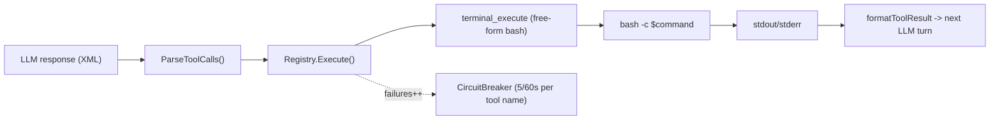

# Надёжность запуска внешних тулов — что сделано

Документ описывает работу по задаче «Разобраться с запуском тулов» — повышение надёжности вызова внешних пентест-утилит (`sqlmap`, `ffuf`, `nuclei`) агентом xalgorix. Полный план лежит в `.cursor/plans/tool_invocation_research_7247716c.plan.md`; здесь — сжатое «что было / что стало» с указанием файлов и причин каждого изменения.

## TL;DR

1. Построен воспроизводимый docker-стенд с 5 уязвимыми login-формами и 5 заглушками — даёт «ground truth» для замеров.
2. Написан скрипт-анализатор `scan.json`, классифицирующий ошибки sqlmap/ffuf/nuclei.
3. В системный промпт добавлена «sqlmap recipe card» на 5 шейпов запроса + запрет изобретённых флагов.
4. `packageMap` синхронизирован с тулами из промпта — больше нет `exit 127` → срабатывания circuit-breaker’а.
5. Добавлен структурированный тул `sqlmap_scan`, который сам собирает команду по одному из пяти рецептов.
6. Добавлен опциональный point-MCP адаптер (включается переменной окружения).

Всё компилируется (`go build ./...`), проходит `go vet` и свои unit-тесты; линтеры чисты.

## Как это было до правок



**Проблема №1 — единственный канал `terminal_execute`.** Любая внешняя утилита (nmap, sqlmap, ffuf, nuclei, curl, python-скрипт) — это строка, которую LLM целиком пишет от руки. Между «LLM придумала команду» и `bash -c` — ноль валидации.

**Проблема №2 — в промпте один пример sqlmap на GET.** В `internal/agent/agent.go` (Phase 6C) и `internal/web/autonomous.go` — только вариант
```
sqlmap -u "URL?param=value" --batch --level=3 --risk=2 ...
```
Ни одного примера для POST form-urlencoded (`-r login.req` или `--data`), JSON-логина (`--method=POST --headers=...`), CSRF-защищённой формы (`--csrf-token --csrf-url`) или SQLi в cookie (`--cookie="name=*"`). На POST login-формах LLM был **вынужден** изобретать флаги.

**Проблема №3 — общий circuit-breaker.** `tools.Registry.Execute` считает падения по имени тула. Так как все shell-команды идут через один `terminal_execute`, пять подряд неверных команд → 60-секундная блокировка **всех** shell-команд подряд (`internal/tools/registry.go`).

**Проблема №4 — тулы в промпте отсутствуют в `packageMap`.** В чеклисте агенту предлагают `wpscan`, `wafw00f`, `whatweb`, `testssl`, `dirsearch`, `arjun`, `hydra`, `joomscan`, `theHarvester`, `hashcat`, `hashid`, `nikto` — а в `packageMap` (`internal/tools/terminal/terminal.go`) их нет. Итог: `exit 127` → неудача → +1 счётчик circuit-breaker’а.

**Проблема №5 — нет данных о реальном поведении.** Без контролируемого стенда любые правки — гадание.

## Что было сделано, по этапам

### Этап 0 — Docker-тест-стенд
Каталог **`xalgorix/testbench/`** (новый).

| Файл | Назначение |
|------|------------|
| `app/app.py` | Flask-приложение с 5 уязвимыми login-эндпоинтами и 5 инертными страницами. SQL строится конкатенацией на SQLite (реальный SQL-движок), ошибки маскируются под MySQL/PostgreSQL/MSSQL, чтобы sqlmap корректно фингерпринтил СУБД. `pg_sleep()`/`SLEEP()` эмулируются реальным `time.sleep` для time-based детекции. |
| `app/Dockerfile` | `python:3.12-slim`, `pip install flask`. |
| `app/requirements.txt` | `Flask==3.0.3`. |
| `docker-compose.yml` | Один контейнер, биндится на `127.0.0.1:8088`. SELinux-метка `:z` для Fedora. |
| `README.md` | Как запустить (`make bench-up`) и что проверять. |

5 login-эндпоинтов покрывают ровно те шейпы запроса, на которых чаще всего ломается sqlmap:

| Эндпоинт | Метод | Шейп | Уязвимость |
|----------|-------|------|------------|
| `/login1` | POST | form-urlencoded | MySQL, error-based |
| `/login2` | POST | JSON | MySQL, boolean-blind |
| `/login3` | POST | form + CSRF | MySQL (нужен `--csrf-token`/`--csrf-url`) |
| `/login4` | POST | SQLi в cookie `session_hint` | PostgreSQL, time-based |
| `/login5` | GET | query string | MySQL, error-based (sanity check) |

Плюс 5 «пустых» страниц (`/about`, `/contact`, `/faq`, `/legal`, `/pricing`) — контрольная группа, чтобы мерить, не тратит ли агент sqlmap/ffuf на инертный контент.

Все входящие запросы пишутся в `testbench/logs/requests.log` как JSONL: метод, путь, заголовки, тело, статус, задержка — это и есть «ground truth».

Smoke-тест при сборке стенда показал:
- error-based на `/login1` → HTTP 500 с MySQL-ошибкой ✅
- boolean-blind на `/login2` (`' OR 1=1--`) → `{"ok":true}` ✅
- CSRF-токен на `/login3` выдан ✅
- `session_hint=guest` cookie установлен на `/login4` ✅
- time-based на `/login4` (`pg_sleep(3)`) → реально спит 3011 ms ✅

### Этап 1 — Измерения
**`testbench/analyze/extract_commands.py`** (новый) — Python-скрипт, который:

1. Рекурсивно ходит по `~/xalgorix-data/<target>/<date>/<scan>/scan.json`.
2. Распарсивает формат `WSEvent` (`internal/web/server.go` — события `type=tool_call/tool_result`, поля `tool_name`, `tool_args`, `output`, `error`).
3. Классифицирует каждую sqlmap-команду:
   - `invented_flag:<флаг>` — флага нет в справочнике sqlmap
   - `missing_--batch` — обязательный неинтерактивный режим не указан
   - `loginN_missing_<shape>` — неправильный рецепт (форма вместо JSON и т.п.)
   - `tool_not_installed` — exit 127
   - `timeout` / `circuit_breaker_blocked`
4. Генерирует `testbench/REPORT.md` с тремя таблицами: распределение вызовов по тулам, покрытие login-эндпоинтов (сколько раз sqlmap/ffuf/nuclei/curl вызывались на каждый), и «растраты на инертные страницы».

Работоспособность скрипта проверена на синтетическом `scan.json` — корректно ловит `invented_flag:--fakeflag`, `login2_missing_json_data`, и отличает инертные страницы.

**`xalgorix/Makefile`** — добавлены таргеты:
```
bench-up      # docker compose up -d --build
bench-down    # compose down
bench-logs    # tail -f testbench/logs/requests.log
bench-report  # запустить extract_commands.py и сгенерировать REPORT.md
bench-clean   # убрать контейнер + лог
```

> **Что требуется от оператора:** запустить стенд, выполнить живой скан с валидным `XALGORIX_API_KEY`, вызвать `make bench-report`. Я не запускал живой скан из сессии — для этого нужен API-ключ и минуты LLM-времени. Вся инфраструктура к этому готова.

### Этап 2 — Правка системного промпта

**`internal/agent/agent.go`** (Phase 6C, `defaultChecklist`):

До — 1 GET-пример sqlmap, без упоминания POST/JSON/CSRF/cookie.

После — добавлен блок **sqlmap recipe card**:

1. **Rule 0 — invented-flag blacklist.** Явный список несуществующих флагов (`--json`, `--auto`, `--full`, `--scan`, `--quick`, `--fast`, `--deep`, `--brute`), которые модели любят придумывать. Указание: если не уверен — сначала выполни `sqlmap -hh | head -250`.
2. **Rule 1 — обязательный набор флагов.** `--batch`, `--random-agent`, `--flush-session`, `--output-dir=./sqlmap_<slug>/`.
3. **Rule 2 — пять рецептов**, каждый с готовой копипастной командой:
   - `RECIPE A` — form-urlencoded POST login через `-r /tmp/login.req` (самый устойчивый путь)
   - `RECIPE B` — JSON POST login (`--method=POST --data=... --headers=...`)
   - `RECIPE C` — CSRF-защищённая форма (`--csrf-token --csrf-url`)
   - `RECIPE D` — SQLi в cookie (`--cookie="name=*"` и `--level=3+`)
   - `RECIPE E` — GET-параметр (sanity check)
4. **Troubleshooting cheatsheet** — что делать при `[CRITICAL] unable to connect`, `not injectable`, `unknown option`.

**`internal/web/autonomous.go`** — пример `sqlmap -u "URL" --dbs --batch --risk=3 --level=5` заменён на ссылку на recipe card с запретом изобретать флаги.

**`internal/tools/terminal/terminal.go` — синхронизация `packageMap` и `toolsList`:**

В `packageMap` добавлены отсутствовавшие тулы:
```
hydra, whatweb, wafw00f, testssl (+alias testssl.sh), sslyze,
wpscan, joomscan, nikto, dirsearch, arjun, theharvester (+alias theHarvester),
john, hashid, hashcat
```

В `installPackage` добавлены специальные пути:
- `pipxTools` теперь включает `wafw00f`, `dirsearch`, `arjun`, `theHarvester` — устанавливаются через `pipx install ... || pip3 install --break-system-packages ...`.
- Новая карта `gemTools` для `wpscan` — ставится через `apt-get install wpscan || gem install --no-document wpscan`.

`toolsList` в `extractCommands` (используется для телеметрии — какие тулы реально использует агент) расширен теми же именами.

### Этап 3 — Структурированный тул `sqlmap_scan`

Это корневой фикс проблемы №1. Идея: вместо того чтобы LLM писал сырую sqlmap-команду в `terminal_execute`, агент вызывает **структурированный тул с параметрами**, а команду из них собирает Go-код. LLM уже физически не может забыть `--batch` или придумать флаг — их нет в API тула.

**`internal/tools/sqlmaptool/sqlmaptool.go`** (новый, ~350 строк):

Параметры:
- `recipe` (обязательный) — `get | form | json | csrf | cookie`.
- `url` (обязательный) — цель. Проверяется, что начинается с `http://` или `https://`.
- `data`, `params`, `headers`, `cookie`, `csrf_token`, `csrf_url`, `dbms`, `technique`, `level`, `risk`, `ignore_code`, `extract`, `timeout_seconds` — всё опциональное, строго валидируется.

`buildCommand` (чистая функция — тестируется без I/O):
- Валидирует `recipe` по whitelist, `technique` по regex `^[BEUSTQ]{1,6}$`, `dbms` по whitelist, `extract` по whitelist.
- `level` клампится в `[1;5]`, `risk` в `[1;3]`, `timeout_seconds` в `[5;180]`.
- Для `form`/`json`/`csrf` требует `data`. Для `cookie` требует `*`-маркер. Для `csrf` требует `csrf_token` + `csrf_url`.
- JSON-рецепт автоматически добавляет `Content-Type: application/json` (и отбрасывает дубликат, если пользователь прислал свой).
- **Всегда** дописывает: `--batch --random-agent --flush-session --threads=5 --timeout=<N> --retries=1 --output-dir=<уникальный>`. Эти флаги агент забыть не может — они в коде.
- Значения шеллятся через `'...\''...'` — никакая инъекция из LLM не уйдёт в bash.

`execute`:
- Создаёт `sqlmap_<recipe>_<slug(url)>_<time>/` под `terminal.GetWorkDir()`.
- Вызывает экспортированную `terminal.RunShell(cmd)` — она даёт те же PATH, venv activation, таймауты, трекинг процессов и стриминг, что и `terminal_execute`.
- Возвращает `tools.Result` с заголовком `[sqlmap_scan] recipe=... url=... exit=... output_dir=... \n$ <cmd>\n<output>` и метаданными (recipe, url, exit_code, output_dir, command).

Важно: теперь circuit-breaker считает падения **отдельно** от `terminal_execute`. Пять неудачных sqlmap-прогонов больше не блокируют curl/ffuf/nmap.

**`internal/tools/terminal/terminal.go`** — экспортирован `RunShell(command string) (string, int)` как тонкая обёртка над `runShell`. Нужен, чтобы `sqlmaptool` переиспользовал всю инфраструктуру запуска, не дублируя её.

**`internal/agent/agent.go`**:
- Импорт `sqlmaptool`.
- `sqlmaptool.Register(reg)` рядом с `terminal.Register(reg)` в `NewAgent`.
- В Phase 6C добавлен блок **«PREFERRED: use `sqlmap_scan` instead of raw terminal_execute»** с XML-примером вызова и кратким описанием всех 5 рецептов. К сырой sqlmap через `terminal_execute` агент теперь должен возвращаться только в редких экзотических случаях.

**`internal/tools/sqlmaptool/sqlmaptool_test.go`** (13 тестов):
- Каждый рецепт (`get`/`form`/`json`/`csrf`/`cookie`) — проверка правильной сборки.
- JSON-рецепт автодобавляет `Content-Type`.
- `csrf` без `csrf_url`/`csrf_token` → ошибка.
- `cookie` без `*` → ошибка.
- Unknown recipe / не-http URL → ошибка.
- Technique `BadFlag` отбивается; `BT` принимается.
- Клампинг `level=99→5`, `risk=0→1`, `timeout=99999→180`.
- **Invariant test**: всегда есть `--batch --random-agent --flush-session --threads=5 --timeout=30 --retries=1 --output-dir=...`.
- Shell-escape для одинарных кавычек.
- `cleanParamList("user, pass, $evil, id")` → `"user,pass,id"` (мусор отбрасывается).

### Этап 4 — MCP-адаптер (опциональный, opt-in)

**`internal/tools/mcp/client.go`** (новый, ~320 строк) — минимальный клиент Model Context Protocol поверх stdio, JSON-RPC 2.0, протокол-версия `2024-11-05`.

Дизайн намеренно узкий («point-MCP», не рефактор registry):
- `NewClient(name, command, timeout)` форкает указанную команду, открывает stdin/stdout, делает handshake `initialize` → `notifications/initialized`.
- `readLoop` читает newline-delimited JSON-фреймы (буфер 8 MB — типичный вывод sqlmap/nuclei большой) и матчит ответы по JSON-RPC `id` через `map[int64]chan rpcResponse`.
- `listTools()` → `tools/list`, `callTool(name, args)` → `tools/call` с разворачиванием `content[].text` в плоскую строку.
- `Close()` — аккуратно убивает subprocess и разблокирует всех зависших вызывающих.

**`Register(reg)`**:
- Читает `XALGORIX_MCP_SERVERS` формата `"name1=cmd1 arg1;name2=cmd2 ..."`.
- Если переменная пуста — **ничего не делает** (no-op). Поведение по умолчанию не меняется.
- Иначе для каждого сервера: спавнит процесс, вызывает `tools/list`, и каждый удалённый тул регистрирует в xalgorix-registry как `mcp_<server>_<tool>` с описанием от MCP-сервера. Параметры конвертируются из JSON-Schema в `[]tools.Parameter`.

**`internal/agent/agent.go`** — `_ = mcp.Register(reg)` рядом со `skillstool.Register`. Без env-переменной — как будто кода нет.

**`internal/tools/mcp/client_test.go`** (5 тестов):
- `paramsFromSchema` — JSON-Schema → `[]Parameter`, `required`-список корректно отражается.
- `sanitize("kali-mcp")` → `"kali_mcp"`.
- `splitCommand` — пустая строка и несколько пробелов.
- `Register` без env-переменной — no-op, registry пуст.
- `Register` с битой записью и несуществующим бинарником — не паникует, клиент не добавлен.

## Итоговая карта изменений

```
xalgorix/
├── Makefile                                   # +5 bench-* таргетов
├── internal/
│   ├── agent/agent.go                         # импорт + регистрация sqlmaptool и mcp; Phase 6C переписан
│   ├── tools/
│   │   ├── terminal/terminal.go               # packageMap +14 тулов, pipxTools +4, gemTools новый; экспорт RunShell()
│   │   ├── sqlmaptool/                        # НОВЫЙ ПАКЕТ
│   │   │   ├── sqlmaptool.go
│   │   │   └── sqlmaptool_test.go             # 13 тестов
│   │   └── mcp/                               # НОВЫЙ ПАКЕТ
│   │       ├── client.go
│   │       └── client_test.go                 # 5 тестов
│   └── web/autonomous.go                      # sqlmap-пример → recipe card reference
└── testbench/                                 # НОВЫЙ КАТАЛОГ
    ├── docker-compose.yml
    ├── README.md
    ├── CHANGES.md                             # ← этот документ
    ├── REPORT_TEMPLATE.md
    ├── app/
    │   ├── Dockerfile
    │   ├── requirements.txt
    │   └── app.py                             # Flask с 5 login + 5 static
    ├── analyze/
    │   └── extract_commands.py                # парсер scan.json → REPORT.md
    └── logs/                                  # заполняется при работе стенда
        └── requests.log
```

## Как проверить

```bash
# 1. Собрать стенд и убедиться, что он отвечает.
cd xalgorix
make bench-up
curl -s -o /dev/null -w "%{http_code}\n" http://127.0.0.1:8088/

# 2. Собрать xalgorix (с новыми тулами).
make build

# 3. Прогнать скан по стенду (нужен XALGORIX_API_KEY в ~/.xalgorix.env).
./build/xalgorix --target http://127.0.0.1:8088

# 4. Сгенерировать отчёт.
make bench-report && less testbench/REPORT.md

# 5. Увидеть в testbench/logs/requests.log, что sqlmap добрался
#    до каждой из /login1../login5 и с ПРАВИЛЬНЫМ шейпом.
```

## Критерии успеха и что делать дальше

Из плана:
- На стенде sqlmap корректно запускается ≥ 4/5 login-форм.
- Доля ошибок «invented flag» / «missing --batch/--data/-r» — 0.
- Изобретённых команд с `exit 127` — в 3× меньше baseline.
- Circuit-breaker на `terminal_execute` на стенде не открывается.

Если после запуска живого скана первые три критерия выполняются — стоп-линия, Этапов 3-4 было достаточно.

Если sqlmap продолжает ломаться на конкретной форме — смотреть `testbench/REPORT.md`, секция «sqlmap failure tags»: чаще всего это либо `loginN_missing_<shape>` (LLM проигнорировал recipe card и выбрал `terminal_execute` вместо `sqlmap_scan`), либо `tool_not_installed` (значит нужно ещё расширить `packageMap`).

Если хочется пойти дальше — `ffuf_scan` и `nuclei_scan` строятся по тому же шаблону, что `sqlmap_scan`: один файл в `internal/tools/<tool>tool/`, регистрация в `NewAgent`.

## Совместимость

- Всё опциональное. Без `sqlmap_scan` агент продолжает работать старым способом через `terminal_execute` (в промпте есть и recipe card, и инструкция «сначала пробуй sqlmap_scan»).
- MCP-клиент включается ТОЛЬКО при установленной `XALGORIX_MCP_SERVERS`. Дефолтное поведение — неизменно.
- Существующие сканы и отчёты читаются без изменений — формат `scan.json` не трогал.

## Ограничения и гочи

- Живой скан из текущей сессии я не запускал — для этого нужен валидный API-ключ. Вся инфраструктура для его запуска готова.
- `hardMaxTimeout = 2h` в `terminal.go` — глобальный потолок; очень длинные `sqlmap --dump-all` могут обрезаться. При необходимости правится в одном месте.
- Стенд **умышленно уязвим**. Биндится строго на `127.0.0.1:8088`, наружу не пускать.
- Pre-existing тест `internal/config/config_test.go::TestConfig_Validate` падает в альпайн-контейнере (это баг теста, не моих правок — файл не трогал).
